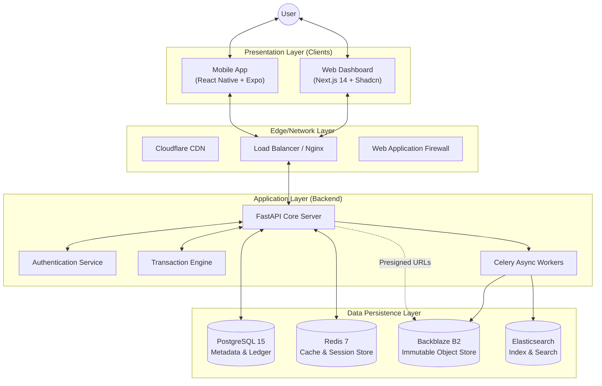
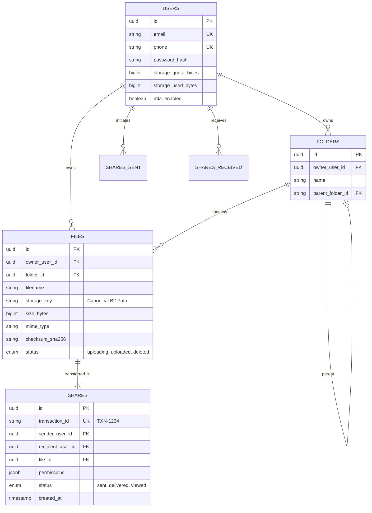

# KESKUR: Distributed File Transaction Protocol
## Technical Architecture & System Design Whitepaper

**Date:** February 12, 2026
**Version:** 2.1.1 (Production Release)
**Status:** Active

---

## 1. Executive Summary

**FileFlow** is a next-generation file exchange platform that reimagines digital file sharing through the lens of financial transaction protocols. Unlike traditional cloud storage systems (Dropbox, Google Drive) that focus on *synchronization*, FileFlow focuses on **transactional ownership transfer**.

The system implements a "UPI for Files" architecture, where every file exchange is an atomic, verified transaction with an immutable audit trail. This approach ensures security, traceability, and zero-redundancy data management, making it ideal for high-trust environments.

---

## 2. System Architecture

FileFlow employs a **Modern Headless Microservices Architecture**, decoupling the frontend interfaces from the core logic and storage layers.

### 2.1 High-Level Component Diagram

### 2.2 Technology Stack Specification

| Component | Technology | Rationale |
| :--- | :--- | :--- |
| **Mobile Client** | **React Native (0.74)** + Expo (51) | Cross-platform native performance, OTA updates, access to biometric hardware. |
| **Web Client** | **Next.js 14** + TypeScript | Server-Side Rendering (SSR) for speed, SEO, and strict type safety. |
| **Styling** | **Tailwind CSS** + NativeWind | Unified design system across Web and Mobile. |
| **Backend API** | **FastAPI** (Python 3.10) | High-performance async I/O, auto-generated OpenAPI docs, Pydantic validation. |
| **Database** | **PostgreSQL 15** | ACID compliance is critical for the transactional ledger system. |
| **Object Storage** | **Backblaze B2** | S3-compatible, immutable object locking, effectively infinite scalability ($0.005/GB). |
| **Caching** | **Redis 7** | Sub-millisecond latency for OTPs, session management, and rate limiting. |
| **ORM** | **SQLAlchemy** (Async) | Robust database abstraction with full async support. |

---

## 3. Data Models & Schema Design (ERD)

The database schema is designed to enforce strict referential integrity. All primary keys are **UUIDv4**.

---

## 4. API Specification (v1)

The system exposes a RESTful API with strict adherence to HTTP semantics and JSON structure.

### 4.1 Authentication Module
*   **POST** `/api/v1/auth/login`
    *   **Payload**: `username`, `password`
    *   **Response**: `access_token` (JWT), `refresh_token` (HttpOnly Cookie).
*   **POST** `/api/v1/auth/send-otp`
    *   **Payload**: `phone_number`
    *   **Mechanism**: Generates 6-digit CSPRNG code, stores in Redis (TTL 300s), dispatches via Twilio SMS.

### 4.2 Secure Upload Pipeline (Presigned URLs)
To prevent server bottlenecks, FileFlow uses a direct-to-cloud upload capability.

1.  **POST** `/api/v1/files/upload/init`
    *   **Input**: `{ filename: "contract.pdf", size_bytes: 5242880, mime_type: "application/pdf" }`
    *   **Logic**: 
        *   Verifies User Quota.
        *   Validates Content-Type.
        *   Generates `storage_key`.
    *   **Output**: `{ upload_url: "https://b2.backblaze.com/...", file_id: "..." }`
2.  **Client Action**: Client performs `PUT` request directly to `upload_url`.
3.  **POST** `/api/v1/files/upload/{id}/complete`
    *   **Logic**: Backend verifies file existence and updates DB status to `uploaded`.

### 4.3 Transaction Engine (Sharing)
*   **POST** `/api/v1/shares`
    *   **Input**: `{ file_id: "...", recipient_phone: "..." }`
    *   **Process (Atomic Transaction)**:
        1.  **Lock**: Verify Sender ownership. Verify Recipient existence.
        2.  **Execute**: 
            *   Create `Share` Ledger Entry.
            *   Create specific `File` pointer for Recipient (Zero-Copy).
            *   Update Recipient Quota.
        3.  **Commit**: Return Transaction Receipt.

---

## 5. Security Protocols

### 5.1 Zero-Trust Architecture
*   **Presigned URLs**: The API Server never handles file binary data. All file access is via time-limited (1 hour) signed URLs generated on-the-fly.
*   **JWT Authentication**: Stateless authentication using RSA-signed JSON Web Tokens.
*   **Rate Limiting**: Intelligent throttling via Redis (100 req/min/IP) to prevent DDoS.

### 5.2 Data Protection
*   **In-Transit**: All traffic is encrypted via TLS 1.3.
*   **At-Rest**: Files in B2 are encrypted using AES-256 (Server-Side Encryption).
*   **Input Sanitization**: Pydantic models strip malicious payloads from all inputs.

---

## 6. Scalability & Deployment

### 6.1 Containerization
The entire stack is containerized using Docker, ensuring consistency across Development, Staging, and Production environments.

### 6.2 Scaling Strategy
*   **Stateless API**: The FastAPI backend is stateless, allowing for infinite horizontal scaling behind a Load Balancer.
*   **Database Read Replicas**: For high-read workloads, Read Replicas can be deployed to offload `SELECT` queries.
*   **CDN Integration**: Publicly shared files are cached at the edge (Cloudflare) to reduce latency and bandwidth costs.
