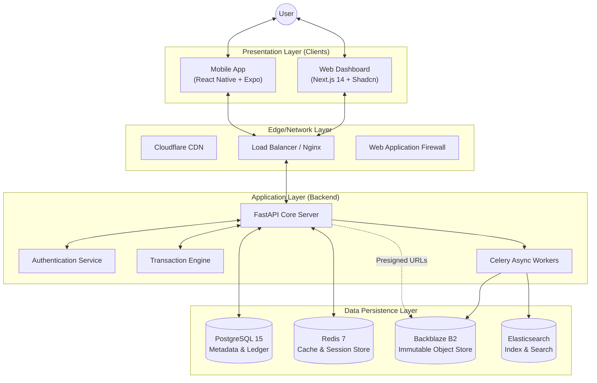
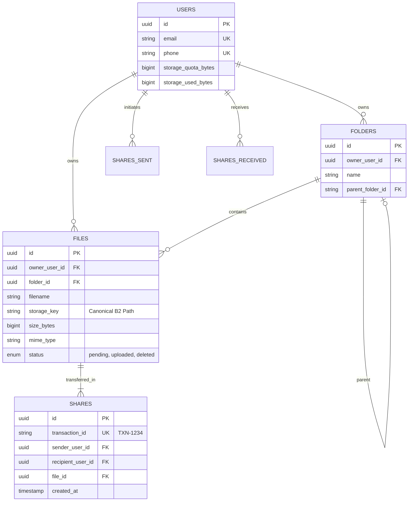

<div align="center">
  
# 🚀 KESKUR: Distributed File Transaction Protocol
**Technical Architecture & System Design Whitepaper**


**Date:** February 28, 2026  |  **Version:** 2.1.1 (Production Release)  |  **Status:** Active

</div>

---

## 1. Executive Summary

**FileFlow** is a next-generation file exchange platform that reimagines digital file sharing through the lens of financial transaction protocols. Unlike traditional cloud storage systems (Dropbox, Google Drive) that focus on *synchronization*, FileFlow focuses on **transactional ownership transfer**.

The system implements a "UPI for Files" architecture, where every file exchange is an atomic, verified transaction with an immutable audit trail. This approach ensures security, traceability, and zero-redundancy data management, making it ideal for high-trust environments.

---

## 2. System Architecture

FileFlow employs a **Modern Headless Microservices Architecture**, decoupling the frontend interfaces from the core logic and storage layers.

### 2.1 High-Level Component Diagram



### 2.2 Technology Stack Specification

| Component | Technology | Rationale |
| :--- | :--- | :--- |
| **Mobile Client** | **React Native (0.74)** + Expo (51) | Cross-platform native performance, OTA updates, native share sheets. |
| **Web Client** | **Next.js 14** + TypeScript | Server-Side Rendering (SSR) for speed, SEO, strict type safety. |
| **Styling** | **Tailwind CSS** + shadcn/ui | Unified design system across Web and Mobile. |
| **Backend API** | **FastAPI** (Python 3.10) | High-performance async I/O, auto-generated OpenAPI docs, Pydantic validation. |
| **Database** | **PostgreSQL 15** | ACID compliance is essential for the transactional ledger system. |
| **Object Storage** | **Backblaze B2** | S3-compatible, immutable object locking, effectively infinite scalability ($0.005/GB). |
| **Caching** | **Redis 7** | Sub-millisecond latency for OTPs, session management, and rate limiting. |
| **PDF Engine** | **PyMuPDF & ReportLab** | Used server-side for flattening e-signatures visually onto PDFs. |
| **ORM** | **SQLAlchemy** (Async) | Robust database abstraction with full async support. |

---

## 3. Data Models & Schema Design (ERD)

The database schema is designed to enforce strict referential integrity. All primary keys are **UUIDv4**.



---

## 4. API Specification & File Flows (v1)

The system exposes a RESTful API with strict adherence to HTTP semantics and JSON structure.

### 4.1 Authentication Module (Passwordless OTP)
*   **POST** `/api/v1/auth/send-otp`
    *   **Payload**: `phone_number`
    *   **Mechanism**: Generates 6-digit code, stores in Redis (TTL 300s), dispatches via Twilio SMS.
*   **POST** `/api/v1/auth/verify-otp`
    *   **Mechanism**: Validates OTP. If phone is new, automatically provisions user account + default folders. Returns stateless JWT `access_token`.

### 4.2 Secure Direct-to-Cloud Upload Pipeline
To prevent server bottlenecks, FileFlow uses direct-to-cloud uploads.
1.  **POST** `/api/v1/files/upload/init`
    *   **Logic**: Verifies User Quota. Generates unique `storage_key`.
    *   **Output**: Backblaze B2 `upload_url` and `authorization_token`.
2.  **Client Action**: Client performs `PUT` request directly to the `upload_url`, bypassing the FastAPI server.
3.  **POST** `/api/v1/files/upload/{id}/complete`
    *   **Logic**: Backend updates DB status to `uploaded` and deducts user quota.

### 4.3 Transaction Engine (Zero-Copy Sharing)
*   **POST** `/api/v1/shares`
    *   **Input**: `{ file_id: "...", recipient_phone: "..." }`
    *   **Process (Atomic Transaction)**:
        1.  **Lock**: Verify Sender ownership. Verify Recipient existence.
        2.  **Execute**: 
            *   Create specific new `File` pointer for Recipient with the exact same `storage_key` as Sender (Zero-Copy).
            *   Create `Share` Ledger Entry.
            *   Update Recipient Quota.
        3.  **Commit**: Return Transaction Receipt.

### 4.4 Internal Native e-Signatures
Users can sign PDF documents directly without external tools.
1. User draws a signature on the Mobile/Web UI, saved as a Base64 image to B2.
2. User overlays a signature box over a PDF viewer and hits "Apply".
3. **POST** `/files/{id}/sign`: Backend pulls the raw PDF to RAM, uses `ReportLab` to draw the image and timestamp, merges it with `PyMuPDF`, and re-uploads it as a brand new unique locked file.

---

## 5. Security Protocols

### 5.1 Zero-Trust Architecture
*   **Presigned URLs**: The API Server never handles file binary data for downloads. All file viewing invokes `GET /files/{id}/view` returning a temporary Presigned URL valid for exactly 1 hour. There are no static links.
*   **JWT Authentication**: Stateless authentication using RSA/HS256 signed JSON Web Tokens.
*   **Rate Limiting**: Intelligent throttling via Redis (using `slowapi`) to prevent DDoS attacks.

### 5.2 Data Protection
*   **At-Rest**: Files in B2 are encrypted.
*   **Input Sanitization**: Pydantic models validate and sanitize all payloads before database interaction.
*   **Immutability**: Once a file is signed or sent, the zero-copy logic ensures it cannot be maliciously edited without wiping the database record.

---

## 6. Scalability & Deployment

### 6.1 Scaling Strategy
*   **Stateless API**: FastAPI relies completely on Postgres/Redis, allowing the API instances to horizontally scale infinitely behind an Nginx Load Balancer or within Kubernetes.
*   **CDN Integration**: Future-ready edge caching for public assets.

### 6.2 Local Development Setup
**Backend (`backend/`)**
```bash
python -m venv venv && source venv/bin/activate
pip install -r requirements.txt
# Requires: DATABASE_URL, REDIS_URL, B2_KEY_ID, B2_APPLICATION_KEY, TWILIO env vars
uvicorn app.main:app --reload --port 8000
```

**Web Dashboard (`web/`)**
```bash
npm install
# Requires: NEXT_PUBLIC_API_URL=http://localhost:8000/api/v1
npm run dev
```

**Mobile App (`mobile/`)**
```bash
npm install
# Update /src/services/api.js with local network IP or Ngrok URL
npx expo start -c
```
